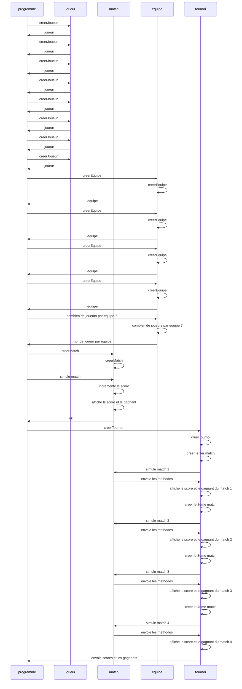
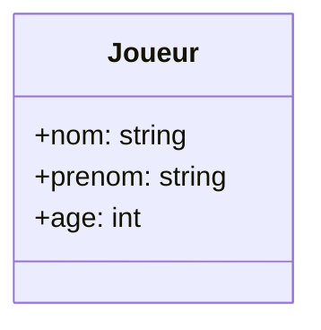
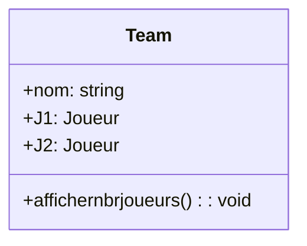
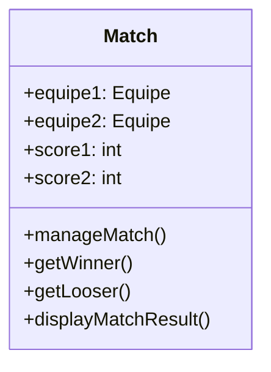
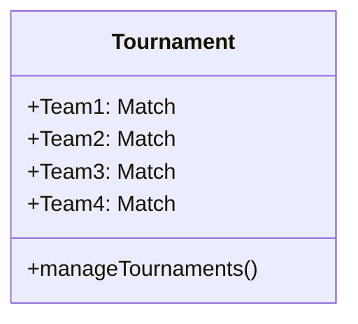

## Diagramme de Séquence

```mermaid
sequenceDiagram
participant programme
participant joueur
participant match
participant equipe
participant tournoi

programme->>joueur: creerJoueur

joueur->>programme: joueur
programme->>joueur: creerJoueur

joueur->>programme: joueur
programme->>joueur: creerJoueur

joueur->>programme: joueur
programme->>joueur: creerJoueur

joueur->>programme: joueur
programme->>joueur: creerJoueur

joueur->>programme: joueur
programme->>joueur: creerJoueur

joueur->>programme: joueur
programme->>joueur: creerJoueur

joueur->>programme: joueur
programme->>joueur: creerJoueur

joueur->>programme: joueur
programme->>equipe: creerEquipe
equipe->>equipe: creerEquipe
equipe->>programme: equipe
programme->>equipe: creerEquipe
equipe->>equipe: creerEquipe
equipe->>programme: equipe
programme->>equipe: creerEquipe
equipe->>equipe: creerEquipe
equipe->>programme: equipe
programme->>equipe: creerEquipe
equipe->>equipe: creerEquipe
equipe->>programme: equipe
programme->>equipe: combien de joueurs par equipe ?
equipe->>equipe: combien de joueurs par equipe ?
equipe->>programme: nbr de joueur par equipe
programme->>match: creerMatch
match->>match: creerMatch
programme->>match: simule match
match->>match: incremente le score
match->>match: affiche le score et le gagnant
match->>programme: ok
programme->>tournoi: creerTournoi
tournoi->>tournoi: creerTournoi
tournoi->>tournoi: creer le 1er match
tournoi->>match: simule match 1
match->>tournoi: envoie les methodes
tournoi->>tournoi: affiche le score et le gagnant du match 1
tournoi->>tournoi: creer le 2eme match
tournoi->>match: simule match 2
match->>tournoi: envoie les methodes
tournoi->>tournoi: affiche le score et le gagnant du match 2
tournoi->>tournoi: creer le 3eme match
tournoi->>match: simule match 3
match->>tournoi: envoie les methodes
tournoi->>tournoi: affiche le score et le gagnant du match 3
tournoi->>tournoi: creer le 4eme match
tournoi->>match: simule match 4
match->>tournoi: envoie les methodes
tournoi->>tournoi: affiche le score et le gagnant du match 4
tournoi->>programme: envoie scores et les gagnants
```

## Diagramme de classe

```mermaid
classDiagram
    class Joueur {
        +nom: string
        +prenom: string
        +age: int
    }
```

```mermaid
classDiagram
    class Team {
        +nom: string
        +J1: Joueur
        +J2: Joueur
        +affichernbrjoueurs(): void
    }
```

```mermaid
classDiagram
    class Match {
        +equipe1: Equipe
        +equipe2: Equipe
        +score1: int
        +score2: int
        +manageMatch()
        +getWinner()
        +getLooser()
        +displayMatchResult()
    }
```

```mermaid
classDiagram
    class Tournament {
        +Team1: Match
        +Team2: Match  
        +Team3: Match
        +Team4: Match
        +manageTournaments()
    }
```