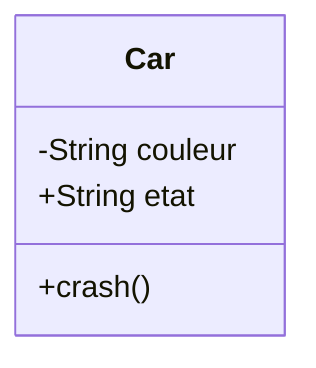
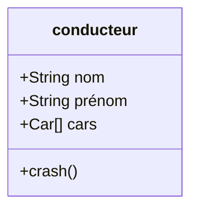
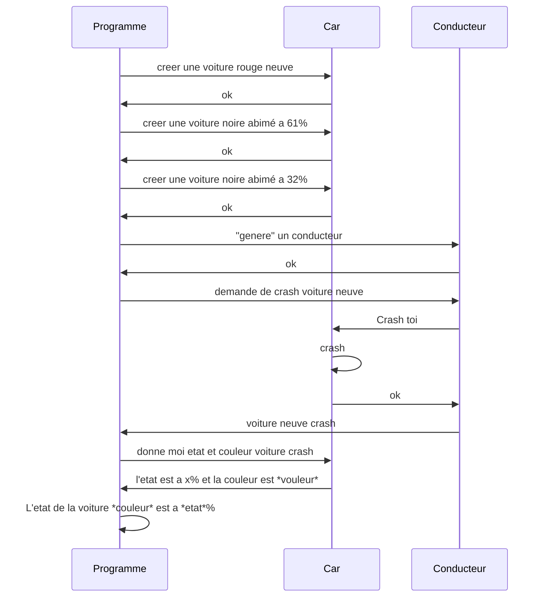

```mermaid
classDiagram
    class Car{
      -String couleur
      +String etat
      +crash()
    }
```

```mermaid
classDiagram
    class conducteur{
      +String nom
      +String prénom
      +Car[] cars
      +crash()
    }
```

```mermaid
sequenceDiagram
participant Programme
participant Car
participant Conducteur
  

  Programme ->> Car : creer une voiture rouge neuve
  Car ->>Programme : ok
  Programme ->> Car : creer une voiture noire abimé a 61%
  Car ->>Programme : ok
  Programme ->> Car :creer une voiture noire abimé a 32%
  Car ->>Programme : ok
  Programme ->> Conducteur : "genere" un conducteur
  Conducteur ->>Programme : ok
  Programme->> Conducteur : demande de crash voiture neuve
  Conducteur->>Car : Crash toi
  Car->>Car : crash
  Car->>Conducteur : ok
  Conducteur ->> Programme : voiture neuve crash
  Programme ->> Car : donne moi etat et couleur voiture crash
  Car ->> Programme : l'etat est a x% et la couleur est *vouleur*
  Programme->>Programme : L'etat de la voiture *couleur* est a *etat*%
```
